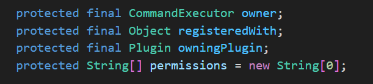
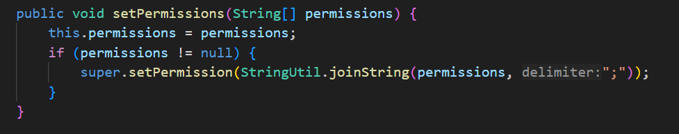
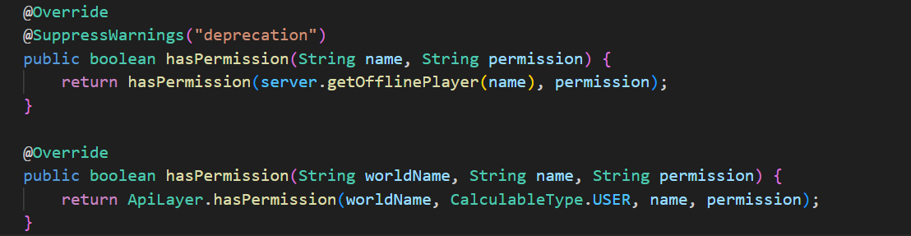
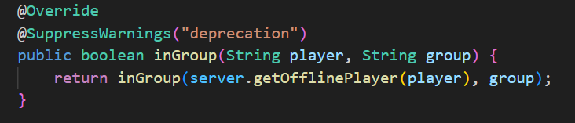

# Code Smells Analysis

## Author: [Rildo Franco]
## Date: [11/06/20204]

---

### Identified Code Smells
1. Data Class

    A Data Class is a code smell where a class contains only fields and basic getters or setters without meaningful behavior or logic. 

    - Location: Entire class located at worldedit-bukkit > src > main > java > com > sk89q > bukkit > util > CommandInfo.java
    - Issue: The issue is that CommandInfo class primarily holds data with getters but lacks significant behavior or logic. This makes it a data class, which can lead to an anemic domain model.

2. Primitive Type Obsession

    The Primitive Type Obsession is a code smell where primitive types  (e.g., integers, strings) are overused instead of creating specific classes or objects to represent complex concepts, leading to unclear and error-prone code.
    
    - Location: Constructor parameters and setPermissions method, located at worldedit-bukkit > src > main > java > com > sk89q > bukkit > util > DynamicPluginCommand.java
    - Issue: method use primitive arrays (String[]) for aliases and permissions. This can be improved by using more expressive types, such as collections or custom types, to encapsulate these concepts better.

    

    

3. Data Clumps

    The Data Clumps is a code smell where groups of related data items frequently appear together in multiple places. This duplication suggests that the data should be encapsulated into a class or object, improving readability, maintainability, and reducing redundancy.

    - Location: Methods parameters in worldedit-bukkit > src > main > java > com > sk89q > bukkit > util > DynamicPluginCommand.java
    - Issue: The methods in the bPermissionsResolver class have repeated groups of data items in their parameters, specifically OfflinePlayer player and String player, as well as (String name, String permission). This can be improved by encapsulating these data items into objects to make the code more readable and maintainable.

    
    
    

---

### Summary
- **Overall Code Health:** 
    The CommandInfo class is primarily a data holder with minimal behavior, leading to a data class smell. This can be refactored to improve code expressiveness and maintainability. 
    
    The DynamicPluginCommand class suffers from primitive type obsession in its constructor parameters and setPermissions method. Using more expressive types, such as collections or custom types, can improve code readability and maintainability. 
    
    The bPermissionsResolver class suffers from data clumps in its method parameters. Encapsulating these data items into objects can improve code readability and maintainability.
