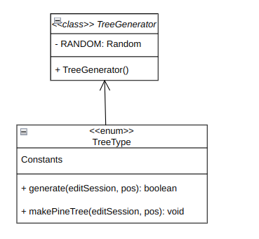

# Design Patterns Report

## Author: Lucas Tobias
## Date: 12-2-2021

---

### 1. Factory Method
- Factory Method is a creative design pattern that provides an interface for creating objects in a superclass, but allows subclasses to change the type of objects that will be created. Its use is found in PermissionsResolver, because it is necessary to create a PermissionsResolver object, but the type of object that will be created depends on the context. `PermissionsResolver` is factory method is responsible for creating the correct PermissionsResolver object, depending on the context. If the server has a registered permissions service, the factory method will create a PluginPermissionsResolver. Otherwise, it will look for a plugin that implements the `PermissionsProvider` interface and create a `PluginPermissionsResolver` based on that plugin.

```java
    public static PermissionsResolver factory(Server server, YAMLProcessor config) {
    // Looking for service
    RegisteredServiceProvider<PermissionsProvider> serviceProvider = server.getServicesManager().getRegistration(PermissionsProvider.class);

    if (serviceProvider != null) {
        return new PluginPermissionsResolver(serviceProvider.getProvider(), serviceProvider.getPlugin());
    }

    // Looking for plugin
    for (Plugin plugin : server.getPluginManager().getPlugins()) {
        if (plugin instanceof PermissionsProvider) {
            return new PluginPermissionsResolver((PermissionsProvider) plugin, plugin);
        }
    }

    return null;
}
```


---

### 2. Command
- Command is a behavioral design that transforms a request into an independent object that contains all the information about the request. It allows you to pass requests as method arguments, postpone or queue the execution of a request and support operations that can be undone. 
- The CommandDispatcher is responsible for registering commands in the system. The `register` method registers a command in the system. It creates a CommandRunner which is responsible for executing the command and posts a CommandEvent to the WorldEdit EventBus. The CommandEvent is responsible for notifying listeners of the execution of a command. After the request, it creates an object.
```java
    public static void register(CommandDispatcher<CommandSourceStack> dispatcher, org.enginehub.piston.Command command) {
    ImmutableList.Builder<String> aliases = ImmutableList.builder();
    aliases.add(command.getName()).addAll(command.getAliases());

    Command<CommandSourceStack> commandRunner = ctx -> {
        WorldEdit.getInstance().getEventBus().post(new com.sk89q.worldedit.event.platform.CommandEvent(
                adaptCommandSource(ctx.getSource()),
                "/" + ctx.getInput()
        ));
        return 0;
    };
```
- The `suggest` method is responsible for suggesting arguments to the command. After the request, it creates an object.
```java
    private static CompletableFuture<Suggestions> suggest(CommandContext<CommandSourceStack> context,
            SuggestionsBuilder builder) throws CommandSyntaxException {
        CommandSuggestionEvent event = new CommandSuggestionEvent(
                FabricAdapter.adaptCommandSource(context.getSource()),
                builder.getInput()
        );
        WorldEdit.getInstance().getEventBus().post(event);
        List<Substring> suggestions = event.getSuggestions();

        ImmutableList.Builder<Suggestion> result = ImmutableList.builder();

        for (Substring suggestion : suggestions) {
            String suggestionText = suggestion.getSubstring();
            // If at end, we are actually suggesting the next argument
            // Ensure there is a space!
            if (suggestion.getStart() == suggestion.getEnd()
                    && suggestion.getEnd() == builder.getInput().length()
                    && !builder.getInput().endsWith(" ")
                    && !builder.getInput().endsWith("\"")) {
                suggestionText = " " + suggestionText;
            }
            result.add(new Suggestion(
                    StringRange.between(suggestion.getStart(), suggestion.getEnd()),
                    suggestionText
            ));
        }

        return CompletableFuture.completedFuture(
                Suggestions.create(builder.getInput(), result.build())
        );


```


---

### 3. Strategy
- Strategy is a behavioral design pattern that allows you to define a family of algorithms, encapsulate each of them and make their objects interchangeable. In the case of TreeGenerator, each tree type (TreeType) implements the tree generation strategy differently.
  Each TreeType implements the generate method, which is responsible for creating the specific tree. This allows the logic for creating each type of tree to be encapsulated within the enumeration itself, randomly, following the Strategy pattern.

```java
public enum TreeType {
TREE("Oak tree", "oak", "tree", "regular"),
BIG_TREE("Large oak tree", "largeoak", "bigoak", "big", "bigtree"),
REDWOOD("Spruce tree", "spruce", "redwood", "sequoia", "sequoioideae"),
TALL_REDWOOD("Tall spruce tree", "tallspruce", "bigspruce", "tallredwood", "tallsequoia", "tallsequoioideae"),
MEGA_REDWOOD("Large spruce tree", "largespruce", "megaredwood"),
RANDOM_REDWOOD("Random spruce tree", "randspruce", "randredwood", "randomredwood", "anyredwood") {
    @Override
    public boolean generate(EditSession editSession, BlockVector3 pos) throws MaxChangedBlocksException {
        TreeType[] choices = { REDWOOD, TALL_REDWOOD, MEGA_REDWOOD };
        return choices[TreeGenerator.RANDOM.nextInt(choices.length)].generate(editSession, pos);
    }
},

```



