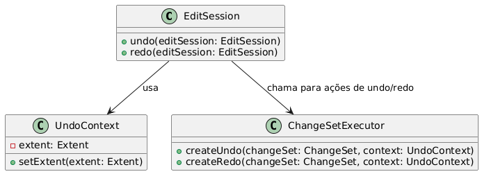

# Design Patterns Report

## Author: [Nicolas Nascimento]
## Date: [11/06/2024]

---

### 1. Command 
In line 852 of the file
worldedit-core/src/main/java/com/sk89q/worldedit/EditSession.java
- This code exemplifies the Command Design Pattern by encapsulating 
the undo and redo actions as commands within specific methods, making them
independent of the calling system. Each action creates an UndoContext and uses ChangeSetExecutor to execute undo or redo, effectively decoupling the action’s execution from its invocation. This approach allows for storing, reusing, and reversing actions, which is ideal for systems requiring history and reversibility, such as editors.

```java
public void undo(EditSession editSession) {
   UndoContext context = new UndoContext();
   context.setExtent(editSession.bypassHistory);
   Operations.completeBlindly(ChangeSetExecutor.createUndo(changeSet, context));
   editSession.internalFlushSession();
}

public void redo(EditSession editSession) {
   UndoContext context = new UndoContext();
   context.setExtent(editSession.bypassHistory);
   Operations.completeBlindly(ChangeSetExecutor.createRedo(changeSet, context));
   editSession.internalFlushSession();
}
``` 



---

### 2. Chain of Responsibility
In line 251 of the file
worldedit-core/src/main/java/com/sk89q/worldedit/EditSession.java

- This code demonstrates the Chain of Responsibility pattern, where 
multiple Extent objects (each with distinct responsibilities, like 
SurvivalModeExtent, BiomeQuirkExtent, ChunkLoadingExtent, etc.) are 
linked in sequence to handle processing in a specific order. Each Extent 
is wrapped around the previous one, creating a chain that allows each layer 
to either handle or modify the action before passing it along. 
This structure supports flexible, modular processing and enables conditional skipping of certain Extent layers based on methods like rawSetBlock() or smartSetBlock().

```java
if (world != null) {
   EditSessionEvent event = new EditSessionEvent(world, actor, maxBlocks, null);
   Watchdog watchdog = WorldEdit.getInstance().getPlatformManager()
       .queryCapability(Capability.GAME_HOOKS).getWatchdog();
   Extent extent;


   // These extents are ALWAYS used
   extent = traceIfNeeded(sideEffectExtent = new SideEffectExtent(world));
   if (watchdog != null) {
       // Reset watchdog before world placement
       WatchdogTickingExtent watchdogExtent = new WatchdogTickingExtent(extent, watchdog);
       extent = traceIfNeeded(watchdogExtent);
       watchdogExtents.add(watchdogExtent);
   }
   extent = traceIfNeeded(survivalExtent = new SurvivalModeExtent(extent, world));
   extent = traceIfNeeded(new BiomeQuirkExtent(extent));
   extent = traceIfNeeded(new ChunkLoadingExtent(extent, world));
   extent = traceIfNeeded(new LastAccessExtentCache(extent));
   extent = traceIfNeeded(blockBagExtent = new BlockBagExtent(extent, blockBag));
   extent = wrapExtent(extent, eventBus, event, Stage.BEFORE_CHANGE);
   this.bypassReorderHistory = traceIfNeeded(new DataValidatorExtent(extent, world));


   // This extent can be skipped by calling rawSetBlock()
   extent = traceIfNeeded(batchingExtent = new BatchingExtent(extent));
   @SuppressWarnings("deprecation")
   MultiStageReorder reorder = new MultiStageReorder(extent, false);
   extent = traceIfNeeded(reorderExtent = reorder);
   extent = traceIfNeeded(chunkBatchingExtent = new ChunkBatchingExtent(extent, false));
   extent = wrapExtent(extent, eventBus, event, Stage.BEFORE_REORDER);
   if (watchdog != null) {
       // reset before buffering extents, since they may buffer all changes
       // before the world-placement reset can happen, and still cause halts
       WatchdogTickingExtent watchdogExtent = new WatchdogTickingExtent(extent, watchdog);
       extent = traceIfNeeded(watchdogExtent);
       watchdogExtents.add(watchdogExtent);
   }
   this.bypassHistory = traceIfNeeded(new DataValidatorExtent(extent, world));


   // These extents can be skipped by calling smartSetBlock()
   extent = traceIfNeeded(changeSetExtent = new ChangeSetExtent(extent, changeSet));
   extent = traceIfNeeded(maskingExtent = new MaskingExtent(extent, Masks.alwaysTrue()));
   extent = traceIfNeeded(changeLimiter = new BlockChangeLimiter(extent, maxBlocks));
   extent = wrapExtent(extent, eventBus, event, Stage.BEFORE_HISTORY);
   this.bypassNone = traceIfNeeded(new DataValidatorExtent(extent, world));
} else {
   Extent extent = new NullExtent();
   extent = traceIfNeeded(survivalExtent = new SurvivalModeExtent(extent, NullWorld.getInstance()));
   extent = traceIfNeeded(blockBagExtent = new BlockBagExtent(extent, blockBag));
   @SuppressWarnings("deprecation")
   MultiStageReorder reorder = new MultiStageReorder(extent, false);
   extent = traceIfNeeded(reorderExtent = reorder);
   extent = traceIfNeeded(maskingExtent = new MaskingExtent(extent, Masks.alwaysTrue()));
   extent = traceIfNeeded(changeLimiter = new BlockChangeLimiter(extent, maxBlocks));
   this.bypassReorderHistory = extent;
   this.bypassHistory = extent;
   this.bypassNone = extent;
}
```


---

### 3. Builder

File in
worldedit-core/src/main/java/com/sk89q/worldedit/EditSessionBuilder.java

- This whole class exemplifies the builder design pattern, because is used to construct a complex object step by step. It allows step-by-step configuration of an EditSession object with methods like world(), maxBlocks(), actor(), and others to set different properties. Each method returns the builder itself (EditSessionBuilder), supporting method chaining. Finally, the build() method constructs and returns the configured EditSession object. This design encapsulates the construction logic and makes it easier to create complex EditSession objects.
```java
public final class EditSessionBuilder {

    private final EventBus eventBus;
    private @Nullable World world;
    private int maxBlocks = -1;
    private @Nullable Actor actor;
    private @Nullable BlockBag blockBag;
    private boolean tracing;

    EditSessionBuilder(EventBus eventBus) {
        this.eventBus = eventBus;
    }
    
    (...)

    public EditSession build() {
        if (WorldEdit.getInstance().getConfiguration().traceUnflushedSessions) {
            return new TracedEditSession(eventBus, world, maxBlocks, blockBag, actor, tracing);
        }
        return new EditSession(eventBus, world, maxBlocks, blockBag, actor, tracing);
    }
}
```


---

### Summary
- **Patterns Chosen:** Command, Chain of Responsibility and State
- **Benefits:** These design patterns enhance system flexibility, modularity, and maintainability. The Command Pattern encapsulates actions as objects, simplifying undo/redo functionality. The Chain of Responsibility Pattern allows layered processing by passing requests through a chain, enabling modular handling and conditional processing. Finally, the Builder Pattern do the step-by-step construction, fluent interface, and handling complex object construction.


