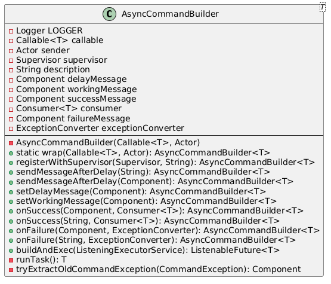

# Design Patterns Report

## Author: [Nicolas Nascimento]
## Date: [11/06/2024]

---

### 1. Template Method 

In line 2319 of the file
worldedit-core/src/main/java/com/sk89q/worldedit/EditSession.java

- The makeShape method in the EditSession class leverages the Template Method design pattern. This pattern is evident because makeShape defines a high-level process for creating shapes, but delegates specific aspects of material selection for each block to a method (getMaterial) that subclasses or anonymous classes are expected to implement. makeShape sets up the parameters for creating a shape and calls the generate method on an ArbitraryShape instance, which is an abstract class. This class has an abstract getMaterial method that subclasses override to provide concrete block materials depending on position and context.

```java
public int makeShape(final Region region, final Vector3 zero, final Vector3 unit,
                     final Pattern pattern, final Expression expression, final boolean hollow, final int timeout)
        throws ExpressionException, MaxChangedBlocksException {

    expression.getSlots().getVariable("x")
            .orElseThrow(IllegalStateException::new);
    expression.getSlots().getVariable("y")
            .orElseThrow(IllegalStateException::new);
    expression.getSlots().getVariable("z")
            .orElseThrow(IllegalStateException::new);

    final Variable typeVariable = expression.getSlots().getVariable("type")
            .orElseThrow(IllegalStateException::new);
    final Variable dataVariable = expression.getSlots().getVariable("data")
            .orElseThrow(IllegalStateException::new);

    final WorldEditExpressionEnvironment environment = new WorldEditExpressionEnvironment(this, unit, zero);
    expression.setEnvironment(environment);

    final int[] timedOut = {0};
    final ArbitraryShape shape = new ArbitraryShape(region) {
        @Override
        protected BaseBlock getMaterial(int x, int y, int z, BaseBlock defaultMaterial) {
            final Vector3 current = Vector3.at(x, y, z);
            environment.setCurrentBlock(current);
            final Vector3 scaled = current.subtract(zero).divide(unit);

            try {
                int[] legacy = LegacyMapper.getInstance().getLegacyFromBlock(defaultMaterial.toImmutableState());
                int typeVar = 0;
                int dataVar = 0;
                if (legacy != null) {
                    typeVar = legacy[0];
                    if (legacy.length > 1) {
                        dataVar = legacy[1];
                    }
                }
                if (expression.evaluate(new double[]{ scaled.x(), scaled.y(), scaled.z(), typeVar, dataVar}, timeout) <= 0) {
                    return null;
                }
                int newType = (int) typeVariable.value();
                int newData = (int) dataVariable.value();
                if (newType != typeVar || newData != dataVar) {
                    BlockState state = LegacyMapper.getInstance().getBlockFromLegacy(newType, newData);
                    return state == null ? defaultMaterial : state.toBaseBlock();
                } else {
                    return defaultMaterial;
                }
            } catch (ExpressionTimeoutException e) {
                timedOut[0] = timedOut[0] + 1;
                return null;
            } catch (RuntimeException e) {
                throw e;
            } catch (Exception e) {
                throw new RuntimeException(e);
            }
        }
    };
    int changed = shape.generate(this, pattern, hollow);
    if (timedOut[0] > 0) {
        throw new ExpressionTimeoutException(
                String.format("%d blocks changed. %d blocks took too long to evaluate (increase with //timeout).",
                        changed, timedOut[0]));
    }
    return changed;
}
``` 


---

### 2. Chain of Responsibility
In line 251 of the file
worldedit-core/src/main/java/com/sk89q/worldedit/EditSession.java

- This code demonstrates the Chain of Responsibility pattern, where 
multiple Extent objects (each with distinct responsibilities, like 
SurvivalModeExtent, BiomeQuirkExtent, ChunkLoadingExtent, etc.) are 
linked in sequence to handle processing in a specific order. Each Extent 
is wrapped around the previous one, creating a chain that allows each layer 
to either handle or modify the action before passing it along. 
This structure supports flexible, modular processing and enables conditional skipping of certain Extent layers based on methods like rawSetBlock() or smartSetBlock().

```java
if (world != null) {
   EditSessionEvent event = new EditSessionEvent(world, actor, maxBlocks, null);
   Watchdog watchdog = WorldEdit.getInstance().getPlatformManager()
       .queryCapability(Capability.GAME_HOOKS).getWatchdog();
   Extent extent;


   // These extents are ALWAYS used
   extent = traceIfNeeded(sideEffectExtent = new SideEffectExtent(world));
   if (watchdog != null) {
       // Reset watchdog before world placement
       WatchdogTickingExtent watchdogExtent = new WatchdogTickingExtent(extent, watchdog);
       extent = traceIfNeeded(watchdogExtent);
       watchdogExtents.add(watchdogExtent);
   }
   extent = traceIfNeeded(survivalExtent = new SurvivalModeExtent(extent, world));
   extent = traceIfNeeded(new BiomeQuirkExtent(extent));
   extent = traceIfNeeded(new ChunkLoadingExtent(extent, world));
   extent = traceIfNeeded(new LastAccessExtentCache(extent));
   extent = traceIfNeeded(blockBagExtent = new BlockBagExtent(extent, blockBag));
   extent = wrapExtent(extent, eventBus, event, Stage.BEFORE_CHANGE);
   this.bypassReorderHistory = traceIfNeeded(new DataValidatorExtent(extent, world));


   // This extent can be skipped by calling rawSetBlock()
   extent = traceIfNeeded(batchingExtent = new BatchingExtent(extent));
   @SuppressWarnings("deprecation")
   MultiStageReorder reorder = new MultiStageReorder(extent, false);
   extent = traceIfNeeded(reorderExtent = reorder);
   extent = traceIfNeeded(chunkBatchingExtent = new ChunkBatchingExtent(extent, false));
   extent = wrapExtent(extent, eventBus, event, Stage.BEFORE_REORDER);
   if (watchdog != null) {
       // reset before buffering extents, since they may buffer all changes
       // before the world-placement reset can happen, and still cause halts
       WatchdogTickingExtent watchdogExtent = new WatchdogTickingExtent(extent, watchdog);
       extent = traceIfNeeded(watchdogExtent);
       watchdogExtents.add(watchdogExtent);
   }
   this.bypassHistory = traceIfNeeded(new DataValidatorExtent(extent, world));


   // These extents can be skipped by calling smartSetBlock()
   extent = traceIfNeeded(changeSetExtent = new ChangeSetExtent(extent, changeSet));
   extent = traceIfNeeded(maskingExtent = new MaskingExtent(extent, Masks.alwaysTrue()));
   extent = traceIfNeeded(changeLimiter = new BlockChangeLimiter(extent, maxBlocks));
   extent = wrapExtent(extent, eventBus, event, Stage.BEFORE_HISTORY);
   this.bypassNone = traceIfNeeded(new DataValidatorExtent(extent, world));
} else {
   Extent extent = new NullExtent();
   extent = traceIfNeeded(survivalExtent = new SurvivalModeExtent(extent, NullWorld.getInstance()));
   extent = traceIfNeeded(blockBagExtent = new BlockBagExtent(extent, blockBag));
   @SuppressWarnings("deprecation")
   MultiStageReorder reorder = new MultiStageReorder(extent, false);
   extent = traceIfNeeded(reorderExtent = reorder);
   extent = traceIfNeeded(maskingExtent = new MaskingExtent(extent, Masks.alwaysTrue()));
   extent = traceIfNeeded(changeLimiter = new BlockChangeLimiter(extent, maxBlocks));
   this.bypassReorderHistory = extent;
   this.bypassHistory = extent;
   this.bypassNone = extent;
}
```


---

### 3. Builder

File in
File
worldedit-core/src/main/java/com/sk89q/worldedit/command/util/AsyncCommandBuilder.java


- This whole class exemplifies the builder design pattern, because it is used to construct a complex object step by step. AsyncCommandBuilder allows various configuration options (e.g., delay messages, success/failure handling, and supervisor monitoring) to be set for an asynchronous command execution. The final object is constructed and executed using the buildAndExec method, which combines the values set through the chain of method calls.
```java
private final Callable<T> callable;
private final Actor sender;


@Nullable
private Supervisor supervisor;
@Nullable
private String description;
@Nullable
private Component delayMessage;
@Nullable
private Component workingMessage;


@Nullable
private Component successMessage;
@Nullable
private Consumer<T> consumer;


@Nullable
private Component failureMessage;
@Nullable
private ExceptionConverter exceptionConverter;


private AsyncCommandBuilder(Callable<T> callable, Actor sender) {
    checkNotNull(callable);
    checkNotNull(sender);
    this.callable = callable;
    this.sender = sender;
}


(...)


public ListenableFuture<T> buildAndExec(ListeningExecutorService executor) {
    final ListenableFuture<T> future = checkNotNull(executor).submit(this::runTask);
    if (delayMessage != null) {
        FutureProgressListener.addProgressListener(
                future,
                sender,
                delayMessage,
                workingMessage
        );
    }
    if (supervisor != null && description != null) {
        supervisor.monitor(FutureForwardingTask.create(future, description, sender));
    }
    return future;
}

```


---

### Summary
- **Patterns Chosen:** Command, Chain of Responsibility and State
- **Benefits:** These design patterns enhance system flexibility, modularity, and maintainability. The Command Pattern encapsulates actions as objects, simplifying undo/redo functionality. The Chain of Responsibility Pattern allows layered processing by passing requests through a chain, enabling modular handling and conditional processing. Finally, the Builder Pattern do the step-by-step construction, fluent interface, and handling complex object construction.


