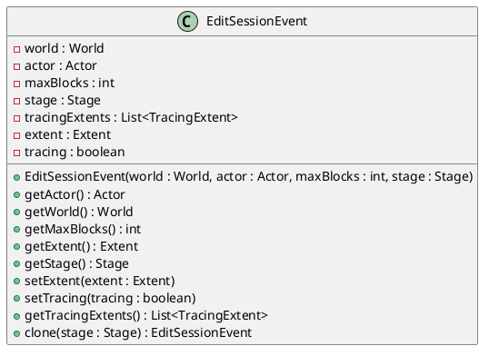
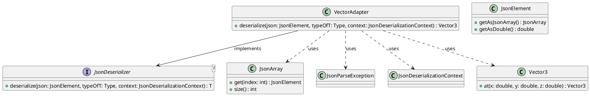
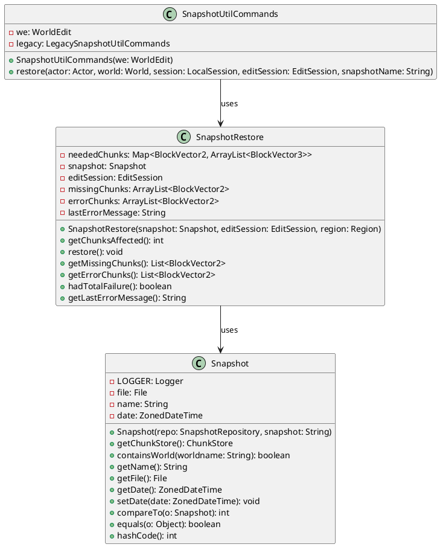

# Design Patterns Report

## Author: [Pedro Amorim]
## Date: [11/08/2024]

---

### 1. Prototype

The EditSessionEvent class utilizes the Prototype design pattern, demonstrated by the clone() method. This method creates a new instance of EditSessionEvent with the same properties as the original event, but with one key modification: it allows for a different Stage to be specified. This approach enables the creation of variations of the original event without constructing entirely new instances, making it easy to reuse the event’s properties while adjusting specific aspects, like the Stage.

Line 176 of the file `worldedit-core/src/main/java/com/sk89q/worldedit/event/extent/EditSessionEvent.java`:

```java
public EditSessionEvent clone(Stage stage) {
       return new EditSessionEvent(world, actor, maxBlocks, stage);
}
```

---

### 2. Adapter

The VectorAdapter class adapts the JSON data format into a Vector3 object. In this case, JSON data is provided as an array, and the adapter converts it to the Vector3 object that the program expects.

```java
public class VectorAdapter implements JsonDeserializer<Vector3> {

    @Override
    public Vector3 deserialize(JsonElement json, Type typeOfT, JsonDeserializationContext context) throws JsonParseException {
        JsonArray jsonArray = json.getAsJsonArray();
        if (jsonArray.size() != 3) {
            throw new JsonParseException("Expected array of 3 length for Vector3");
        }


        double x = jsonArray.get(0).getAsDouble();
        double y = jsonArray.get(1).getAsDouble();
        double z = jsonArray.get(2).getAsDouble();


        return Vector3.at(x, y, z);
    }
}
```

---

### 3. Memento
The Memento pattern's concept is applied to restore a snapshot of a Minecraft world to a previous state. The pattern is designed to capture and restore an object's state without breaking encapsulation, allowing rollback or restoration of the state.
```java
public void restore(Actor actor, World world, LocalSession session, EditSession editSession,
                       @Arg(name = "snapshot", desc = "The snapshot to restore", def = "")
                           String snapshotName) throws WorldEditException, IOException {
       LocalConfiguration config = we.getConfiguration();
       checkSnapshotsConfigured(config);


       if (config.snapshotRepo != null) {
           legacy.restore(actor, world, session, editSession, snapshotName);
           return;
       }


       Region region = session.getSelection(world);
       Snapshot snapshot;


       if (snapshotName != null) {
           URI uri = resolveSnapshotName(config, snapshotName);
           Optional<Snapshot> snapOpt = config.snapshotDatabase.getSnapshot(uri);
           if (snapOpt.isEmpty()) {
               actor.printError(TranslatableComponent.of("worldedit.restore.not-available"));
               return;
           }
           snapshot = snapOpt.get();
       } else {
           snapshot = session.getSnapshotExperimental();
       }


       // No snapshot set?
       if (snapshot == null) {
           try (Stream<Snapshot> snapshotStream =
                    config.snapshotDatabase.getSnapshotsNewestFirst(world.getName())) {
               snapshot = snapshotStream
                   .findFirst().orElse(null);
           }


           if (snapshot == null) {
               actor.printError(TranslatableComponent.of(
                   "worldedit.restore.none-for-specific-world",
                   TextComponent.of(world.getName())
               ));
               return;
           }
       }
       actor.printInfo(TranslatableComponent.of(
           "worldedit.restore.loaded",
           TextComponent.of(snapshot.getInfo().getDisplayName())
       ));


       try {
           SnapshotRestore restore = new SnapshotRestore(snapshot, editSession, region);
           restore.restore();


           if (restore.hadTotalFailure()) {
               String error = restore.getLastErrorMessage();
               if (!restore.getMissingChunks().isEmpty()) {
                   actor.printError(TranslatableComponent.of("worldedit.restore.chunk-not-present"));
               } else if (error != null) {
                   actor.printError(TranslatableComponent.of("worldedit.restore.block-place-failed"));
                   actor.printError(TranslatableComponent.of("worldedit.restore.block-place-error", TextComponent.of(error)));
               } else {
                   actor.printError(TranslatableComponent.of("worldedit.restore.chunk-load-failed"));
               }
           } else {
               actor.printInfo(TranslatableComponent.of("worldedit.restore.restored",
                   TextComponent.of(restore.getMissingChunks().size()),
                   TextComponent.of(restore.getErrorChunks().size())));
           }
       } finally {
           try {
               snapshot.close();
           } catch (IOException ignored) {
           }
       }
   }
```

```java
public void restore() throws MaxChangedBlocksException {


       missingChunks = new ArrayList<>();
       errorChunks = new ArrayList<>();


       for (Map.Entry<BlockVector2, ArrayList<BlockVector3>> entry : neededChunks.entrySet()) {
           BlockVector2 chunkPos = entry.getKey();
           Chunk chunk;


           try {
               chunk = snapshot.getChunk(chunkPos.toBlockVector3());
               for (BlockVector3 pos : entry.getValue()) {
                   try {
                       editSession.setBlock(pos, chunk.getBlock(pos));
                   } catch (DataException e) {
                       // this is a workaround: just ignore for now
                   }
               }
           } catch (MissingChunkException me) {
               missingChunks.add(chunkPos);
           } catch (IOException | DataException me) {
               errorChunks.add(chunkPos);
               lastErrorMessage = me.getMessage();
           }
       }
   }
```

---


