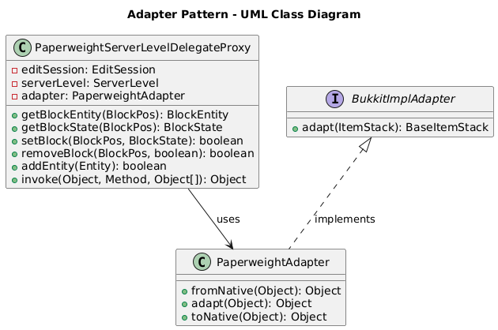
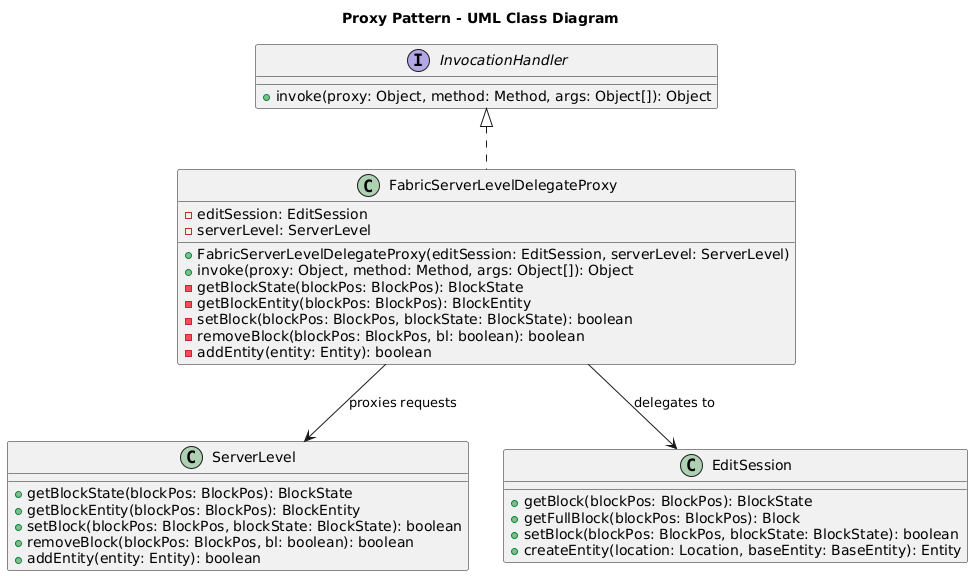

# Design Patterns Report

## Author: [Rildo Franco]
## Date: [11/06/2024]

---

### 1. Adapter

worldedit-bukkit\adapters\adapter-1.20.2\src\main\java\com\sk89q\worldedit\bukkit\adapter\impl\v1_20_R2\PaperWeightServerLevelDelegateProxy.java

The class PaperweightServerLevelDelegateProxy uses a PaperweightAdapter to adapt and manipulate Minecraft-specific objects and states. The invoke method intercepts method calls and delegates them to the appropriate methods in the PaperweightAdapter or handles them directly.

```java

@Nullable
private BlockEntity getBlockEntity(BlockPos blockPos) {
    BlockEntity tileEntity = this.serverLevel.getChunkAt(blockPos).getBlockEntity(blockPos);
    if (tileEntity == null) {
        return null;
    }
    BlockEntity newEntity = tileEntity.getType().create(blockPos, getBlockState(blockPos));
    newEntity.load((CompoundTag) adapter.fromNative(this.editSession.getFullBlock(BlockVector3.at(blockPos.getX(), blockPos.getY(), blockPos.getZ())).getNbtReference().getValue()));

    return newEntity;
}

private BlockState getBlockState(BlockPos blockPos) {
    return adapter.adapt(this.editSession.getBlock(BlockVector3.at(blockPos.getX(), blockPos.getY(), blockPos.getZ())));
}

private boolean setBlock(BlockPos blockPos, BlockState blockState) {
    try {
        return editSession.setBlock(BlockVector3.at(blockPos.getX(), blockPos.getY(), blockPos.getZ()), adapter.adapt(blockState));
    } catch (MaxChangedBlocksException e) {
        throw new RuntimeException(e);
    }
}

```

worldedit-bukkit\adapters\adapter-1.20.2\src\main\java\com\sk89q\worldedit\bukkit\adapter\impl\v1_20_R2\PaperWeightAdapter.java

```java
Tag fromNative(LinTag<?> foreign) {
        if (foreign == null) {
            return null;
        }
        if (foreign instanceof LinCompoundTag compoundTag) {
            net.minecraft.nbt.CompoundTag tag = new CompoundTag();
            for (var entry : compoundTag.value().entrySet()) {
                tag.put(entry.getKey(), fromNative(entry.getValue()));
            }
            return tag;
        } else if (foreign instanceof LinByteTag byteTag) {
            return ByteTag.valueOf(byteTag.valueAsByte());
        } else if (foreign instanceof LinByteArrayTag byteArrayTag) {
            return new ByteArrayTag(byteArrayTag.value());
        } else if (foreign instanceof LinDoubleTag doubleTag) {
            return DoubleTag.valueOf(doubleTag.valueAsDouble());
        } else if (foreign instanceof LinFloatTag floatTag) {
            return FloatTag.valueOf(floatTag.valueAsFloat());
        } else if (foreign instanceof LinIntTag intTag) {
            return IntTag.valueOf(intTag.valueAsInt());
        } else if (foreign instanceof LinIntArrayTag intArrayTag) {
            return new IntArrayTag(intArrayTag.value());
        } else if (foreign instanceof LinLongArrayTag longArrayTag) {
            return new LongArrayTag(longArrayTag.value());
        } else if (foreign instanceof LinListTag<?> listTag) {
            net.minecraft.nbt.ListTag tag = new ListTag();
            for (var t : listTag.value()) {
                tag.add(fromNative(t));
            }
            return tag;
        } else if (foreign instanceof LinLongTag longTag) {
            return LongTag.valueOf(longTag.valueAsLong());
        } else if (foreign instanceof LinShortTag shortTag) {
            return ShortTag.valueOf(shortTag.valueAsShort());
        } else if (foreign instanceof LinStringTag stringTag) {
            return StringTag.valueOf(stringTag.value());
        } else if (foreign instanceof LinEndTag) {
            return EndTag.INSTANCE;
        } else {
            throw new IllegalArgumentException("Don't know how to make NMS " + foreign.getClass().getCanonicalName());
        }
    }

    public net.minecraft.world.level.block.state.BlockState adapt(BlockState blockState) {
        int internalId = BlockStateIdAccess.getBlockStateId(blockState);
        return Block.stateById(internalId);
    }
```



---

### 2. Proxy

worldedit-fabric\src\main\java\com\sk89q\worldedit\fabric\internal\FabricServerLevelDelegateProxy.java

The Proxy Pattern is used in the FabricServerLevelDelegateProxy class to control access to the ServerLevel class. The proxy class wraps the ServerLevel class and may handle some lighter responsibilities itself, while delegating substantive requests to the ServerLevel class. This allows for additional functionality to be added without modifying the ServerLevel class directly. Both the proxy class and the ServerLevel class implement a common interface, allowing for polymorphism. It Wraps the real subject class (ServerLevel).

The newInstance method creates a proxy instance of WorldGenLevel that uses FabricServerLevelDelegateProxy as its invocation handler.

```java
public static WorldGenLevel newInstance(EditSession editSession, ServerLevel serverLevel) {
    return (WorldGenLevel) Proxy.newProxyInstance(
        serverLevel.getClass().getClassLoader(),
        serverLevel.getClass().getInterfaces(),
        new FabricServerLevelDelegateProxy(editSession, serverLevel)
    );
}

```

The FabricServerLevelDelegateProxy class implements the InvocationHandler interface, which allows it to intercept method calls on the proxy instance.

The FabricServerLevelDelegateProxy class provides implementations for methods such as getBlockEntity, getBlockState, setBlock, removeBlock, and addEntity, which are called by the invoke method.

```java
@Nullable
private BlockEntity getBlockEntity(BlockPos blockPos) {
    BlockEntity tileEntity = this.serverLevel.getChunkAt(blockPos).getBlockEntity(blockPos);
    if (tileEntity == null) {
        return null;
    }
    BlockEntity newEntity = tileEntity.getType().create(blockPos, getBlockState(blockPos));
    newEntity.loadWithComponents(
        NBTConverter.toNative(
            this.editSession.getFullBlock(FabricAdapter.adapt(blockPos)).getNbtReference().getValue()
        ),
        this.serverLevel.registryAccess()
    );

    return newEntity;
}

private BlockState getBlockState(BlockPos blockPos) {
    return FabricAdapter.adapt(this.editSession.getBlock(FabricAdapter.adapt(blockPos)));
}

private boolean setBlock(BlockPos blockPos, BlockState blockState) {
    try {
        return editSession.setBlock(FabricAdapter.adapt(blockPos), FabricAdapter.adapt(blockState));
    } catch (MaxChangedBlocksException e) {
        throw new RuntimeException(e);
    }
}

private boolean removeBlock(BlockPos blockPos, boolean bl) {
    try {
        return editSession.setBlock(FabricAdapter.adapt(blockPos), BlockTypes.AIR.getDefaultState());
    } catch (MaxChangedBlocksException e) {
        throw new RuntimeException(e);
    }
}

private boolean addEntity(Entity entity) {
    Vector3 pos = FabricAdapter.adapt(entity.getPosition(0.0f));
    Location location = new Location(FabricAdapter.adapt(serverLevel), pos.x(), pos.y(), pos.z());
    BaseEntity baseEntity = new FabricEntity(entity).getState();
    return editSession.createEntity(location, baseEntity) != null;
}
```


---

### 3. Observer

worldedit-core\src\main\java\com\sk89q\worldedit\extension\platform\PlatformManager.java

The Observer Pattern is used in the PlatformManager class to allow objects to subscribe to events and be notified when those events occur. The PlatformManager class registers itself with the EventBus to listen for various events and handle them accordingly.

The PlatformManager class contains methods annotated with @Subscribe to handle different types of events such as PlatformsRegisteredEvent, PlatformReadyEvent, PlatformUnreadyEvent, BlockInteractEvent, and PlayerInputEvent.

```java
public class PlatformManager {

    private static final Logger LOGGER = LogManagerCompat.getLogger();

    private final WorldEdit worldEdit;
    private final PlatformCommandManager platformCommandManager;
    private final List<Platform> platforms = new ArrayList<>();
    private final Map<Capability, Platform> preferences = new EnumMap<>(Capability.class);
    private @Nullable String firstSeenVersion;
    private final AtomicBoolean initialized = new AtomicBoolean();
    private final AtomicBoolean configured = new AtomicBoolean();

    /**
     * Create a new platform manager.
     *
     * @param worldEdit the WorldEdit instance
     */
    public PlatformManager(WorldEdit worldEdit) {
        checkNotNull(worldEdit);
        this.worldEdit = worldEdit;
        this.platformCommandManager = new PlatformCommandManager(worldEdit, this);

        // Register this instance for events
        worldEdit.getEventBus().register(this);
    }
}

/**
 * Internal, do not call.
 */
@Subscribe
public void handlePlatformsRegistered(PlatformsRegisteredEvent event) {
    choosePreferred();
    if (initialized.compareAndSet(false, true)) {
        worldEdit.getEventBus().post(new PlatformInitializeEvent());
    }
}

/**
 * Internal, do not call.
 */
@Subscribe
public void handleNewPlatformReady(PlatformReadyEvent event) {
    preferences.forEach((cap, platform) -> cap.ready(this, platform));
}

/**
 * Internal, do not call.
 */
@Subscribe
public void handleNewPlatformUnready(PlatformUnreadyEvent event) {
    preferences.forEach((cap, platform) -> cap.unready(this, platform));
}

@Subscribe
public void handleBlockInteract(BlockInteractEvent event) {
    // Create a proxy actor with a potentially different world for
    // making changes to the world
    Actor actor = createProxyActor(event.getCause());

    Location location = event.getLocation();

    // At this time, only handle interaction from players
    if (!(actor instanceof Player player)) {
        return;
    }
    LocalSession session = worldEdit.getSessionManager().get(actor);

    Request.reset();
    Request.request().setSession(session);
    Request.request().setWorld(player.getWorld());

    try {
        if (event.getType() == Interaction.HIT) {
            // superpickaxe is special because its primary interaction is a left click, not a right click
            // in addition, it is implicitly bound to all pickaxe items, not just a single tool item
            if (session.hasSuperPickAxe() && player.isHoldingPickAxe()) {
                final BlockTool superPickaxe = session.getSuperPickaxe();
                if (superPickaxe != null && superPickaxe.canUse(player)) {
                    if (superPickaxe.actPrimary(queryCapability(Capability.WORLD_EDITING),
                            getConfiguration(), player, session, location, event.getFace())) {
                        event.setCancelled(true);
                    }
                    return;
                }
            }

            Tool tool = session.getTool(player.getItemInHand(HandSide.MAIN_HAND).getType());
            if (tool instanceof DoubleActionBlockTool && tool.canUse(player)) {
                if (((DoubleActionBlockTool) tool).actSecondary(queryCapability(Capability.WORLD_EDITING),
                        getConfiguration(), player, session, location, event.getFace())) {
                    event.setCancelled(true);
                }
            }

        } else if (event.getType() == Interaction.OPEN) {
            Tool tool = session.getTool(player.getItemInHand(HandSide.MAIN_HAND).getType());
            if (tool instanceof BlockTool && tool.canUse(player)) {
                if (((BlockTool) tool).actPrimary(queryCapability(Capability.WORLD_EDITING),
                        getConfiguration(), player, session, location, event.getFace())) {
                    event.setCancelled(true);
                }
            }
        }
    } finally {
        Request.reset();
    }
}

@Subscribe
public void handlePlayerInput(PlayerInputEvent event) {
    // Create a proxy actor with a potentially different world for
    // making changes to the world
    Player player = createProxyActor(event.getPlayer());
    LocalSession session = worldEdit.getSessionManager().get(player);
    Request.reset();
    Request.request().setSession(session);
    Request.request().setWorld(player.getWorld());

    try {
        switch (event.getInputType()) {
            case PRIMARY: {
                Tool tool = session.getTool(player.getItemInHand(HandSide.MAIN_HAND).getType());
                if (tool instanceof DoubleActionTraceTool && tool.canUse(player)) {
                    if (((DoubleActionTraceTool) tool).actSecondary(queryCapability(Capability.WORLD_EDITING),
                            getConfiguration(), player, session)) {
                        event.setCancelled(true);
                    }
                    return;
                }

                break;
            }

            case SECONDARY: {
                Tool tool = session.getTool(player.getItemInHand(HandSide.MAIN_HAND).getType());
                if (tool instanceof TraceTool && tool.canUse(player)) {
                    if (((TraceTool) tool).actPrimary(queryCapability(Capability.WORLD_EDITING),
                            getConfiguration(), player, session)) {
                        event.setCancelled(true);
                    }
                    return;
                }

                break;
            }

            default:
                break;
        }
    } finally {
        Request.reset();
    }
}

@Subscribe
public void handlePlayerInput(PlayerInputEvent event) {
    // Create a proxy actor with a potentially different world for
    // making changes to the world
    Player player = createProxyActor(event.getPlayer());
    LocalSession session = worldEdit.getSessionManager().get(player);
    Request.reset();
    Request.request().setSession(session);
    Request.request().setWorld(player.getWorld());

    try {
        switch (event.getInputType()) {
            case PRIMARY: {
                Tool tool = session.getTool(player.getItemInHand(HandSide.MAIN_HAND).getType());
                if (tool instanceof DoubleActionTraceTool && tool.canUse(player)) {
                    if (((DoubleActionTraceTool) tool).actSecondary(queryCapability(Capability.WORLD_EDITING),
                            getConfiguration(), player, session)) {
                        event.setCancelled(true);
                    }
                    return;
                }

                break;
            }

            case SECONDARY: {
                Tool tool = session.getTool(player.getItemInHand(HandSide.MAIN_HAND).getType());
                if (tool instanceof TraceTool && tool.canUse(player)) {
                    if (((TraceTool) tool).actPrimary(queryCapability(Capability.WORLD_EDITING),
                            getConfiguration(), player, session)) {
                        event.setCancelled(true);
                    }
                    return;
                }

                break;
            }

            default:
                break;
        }
    } finally {
        Request.reset();
    }
}
```

@Subscribe
public void handleNewPlatformUnready(PlatformUnreadyEvent event) {
    preferences.forEach((cap, platform) -> cap.unready(this, platform));
}

worldedit-core\src\main\java\com\sk89q\worldedit\extension\platform\WorldEdit.java

```java
    private final EventBus eventBus = new EventBus();
```

worldedit-core\src\main\java\com\sk89q\worldedit\util\eventbus\EventBus.java

```java
public void subscribe(Class<?> clazz, EventHandler handler) {
        checkNotNull(clazz);
        checkNotNull(handler);
        lock.writeLock().lock();
        try {
            handlersByType.put(clazz, handler);
        } finally {
            lock.writeLock().unlock();
        }
    }

    /**
     * Registers the given handler for the given class to receive events.
     *
     * @param handlers a map of handlers
     */
    public void subscribeAll(Multimap<Class<?>, EventHandler> handlers) {
        checkNotNull(handlers);
        lock.writeLock().lock();
        try {
            handlersByType.putAll(handlers);
        } finally {
            lock.writeLock().unlock();
        }
    }

    /**
     * Unregisters the given handler for the given class.
     *
     * @param clazz the class
     * @param handler the handler
     */
    public void unsubscribe(Class<?> clazz, EventHandler handler) {
        checkNotNull(clazz);
        checkNotNull(handler);
        lock.writeLock().lock();
        try {
            handlersByType.remove(clazz, handler);
        } finally {
            lock.writeLock().unlock();
        }
    }

    /**
     * Unregisters the given handlers.
     *
     * @param handlers a map of handlers
     */
    public void unsubscribeAll(Multimap<Class<?>, EventHandler> handlers) {
        checkNotNull(handlers);
        lock.writeLock().lock();
        try {
            for (Map.Entry<Class<?>, Collection<EventHandler>> entry : handlers.asMap().entrySet()) {
                handlersByType.get(entry.getKey()).removeAll(entry.getValue());
            }
        } finally {
            lock.writeLock().unlock();
        }
    }

    /**
     * Registers all handler methods on {@code object} to receive events.
     * Handler methods are selected and classified using this EventBus's
     * {@link SubscriberFindingStrategy}; the default strategy is the
     * {@link AnnotatedSubscriberFinder}.
     *
     * @param object object whose handler methods should be registered.
     */
    public void register(Object object) {
        subscribeAll(finder.findAllSubscribers(object));
    }

    /**
     * Unregisters all handler methods on a registered {@code object}.
     *
     * @param object  object whose handler methods should be unregistered.
     * @throws IllegalArgumentException if the object was not previously registered.
     */
    public void unregister(Object object) {
        unsubscribeAll(finder.findAllSubscribers(object));
    }

    /**
     * Posts an event to all registered handlers.  This method will return
     * successfully after the event has been posted to all handlers, and
     * regardless of any exceptions thrown by handlers.
     *
     * @param event  event to post.
     */
    public void post(Object event) {
        List<EventHandler> dispatching = new ArrayList<>();

        Set<Class<?>> dispatchTypes = flattenHierarchyCache.get(event.getClass());
        lock.readLock().lock();
        try {
            for (Class<?> eventType : dispatchTypes) {
                Set<EventHandler> wrappers = handlersByType.get(eventType);

                if (wrappers != null && !wrappers.isEmpty()) {
                    dispatching.addAll(wrappers);
                }
            }
        } finally {
            lock.readLock().unlock();
        }

        Collections.sort(dispatching);

        for (EventHandler handler : dispatching) {
            dispatch(event, handler);
        }
    }

    /**
     * Dispatches {@code event} to the handler in {@code handler}.
     *
     * @param event  event to dispatch.
     * @param handler  handler that will call the handler.
     */
    private void dispatch(Object event, EventHandler handler) {
        try {
            handler.handleEvent(event);
        } catch (InvocationTargetException e) {
            LOGGER.error("Could not dispatch event: " + event + " to handler " + handler, e);
        }
    }
```

---

