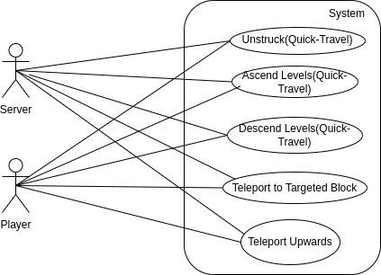

# Use Case Diagram Report

## Author: Lucas Tobias
## Date: [11/11/2024]

# Use Case Descriptions

## Use Case 1: Unstuck Player
- **Description:** When the User is stuck in a block, they are teleported to the nearest position where they are not stuck. The server handles the teleportation.
- **Primary Actor:** User (Player)
- **Secondary Actor:** Server

## Use Case 2: Ascend Levels
- **Description:** The player is teleported to the platform of the specified floor (one position above the current one). The server handles the teleportation.
- **Primary Actor:** User (Player)
- **Secondary Actor:** Server

## Use Case 3: Descend Levels
- **Description:** The player is teleported to the platform of the specified floor (one position below the current one). The server handles the teleportation.
- **Primary Actor:** User (Player)
- **Secondary Actor:** Server

## Use Case 4: Teleport to Targeted Block
- **Description:** The player is teleported to the position of the target block. The server puts it there.
- **Primary Actor:** User (Player)
- **Secondary Actor:** Server

## Use Case 5: Teleport Upwards
- **Description:** The player is teleported with the help of the server to a position at the specified height.
- **Primary Actor:** User (Player)
- **Secondary Actor:** None

