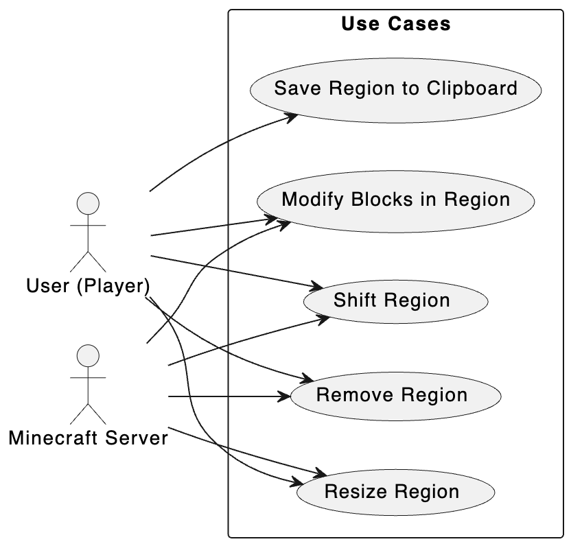

# Use Case Diagram Report

## Author: Nicolas Nascimento
## Date: 11/11/2024

# Use Case Descriptions

## Use Case 1: Resize Region
- **Description:** Allows the player to change the size of a selected region, either by expanding or contracting it. The player can modify the bounds of the region in all directions.
- **Primary Actor:** User (Player)
- **Secondary Actor:**  Minecraft Server

## Use Case 2: Remove Region
- **Description:** Deletes the selected region, permanently removing the blocks within it from the world.
- **Primary Actor:** User (Player)
- **Secondary Actor:** Minecraft Server

## Use Case 3: Shift Region
- **Description:** Moves the selected region of blocks to a different location in the Minecraft world.
- **Primary Actor:** User (Player)
- **Secondary Actor:** Minecraft Server

## Use Case 4: Modify Blocks in Region
- **Description:** Players can modify the blocks within a selected region, such as replacing one block type with another or modifying attributes of blocks within the region.
- **Primary Actor:** User (Player)
- **Secondary Actor:** Minecraft Server

## Use Case 5: Save Region to Clipboard
- **Description:** The player saves a selected region into an in-memory clipboard for future pasting or manipulation.
- **Primary Actor:** User (Player)
- **Secondary Actor:** None
