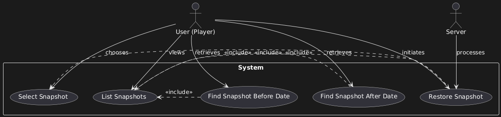

# Use Case Diagram Report

## Author: [Rildo Franco]
## Date: [11/11/2024]

# Use Case Descriptions

## Use Case 1: Restore Snapshot
- **Description:** User restores the world to a specified snapshot, replacing the current state with the backup. This action undoes any changes made since the snapshot was saved.
- **Primary Actor:** User (Player)
- **Secondary Actor:** Server

## Use Case 2: Select Snapshot
- **Description:** User selects a specific snapshot from the list for potential restoration or review, setting it as the active snapshot in the session.
- **Primary Actor:** User (Player)
- **Secondary Actor:** None

## Use Case 3: List Snapshots
- **Description:** User views the five most recent snapshots available, sorted by creation date, to choose from or inspect past backups.
- **Primary Actor:** User (Player)
- **Secondary Actor:** None

## Use Case 4: Find Snapshot Before Date
- **Description:** User retrieves the latest snapshot created before a specified date to review changes up to that point.
- **Primary Actor:** User (Player)
- **Secondary Actor:** None

## Use Case 5: Find Snapshot After Date
- **Description:** User retrieves the earliest snapshot created after a specified date, enabling a targeted review of recent backups.
- **Primary Actor:** User (Player)
- **Secondary Actor:** None

Diagram

